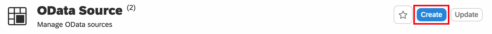
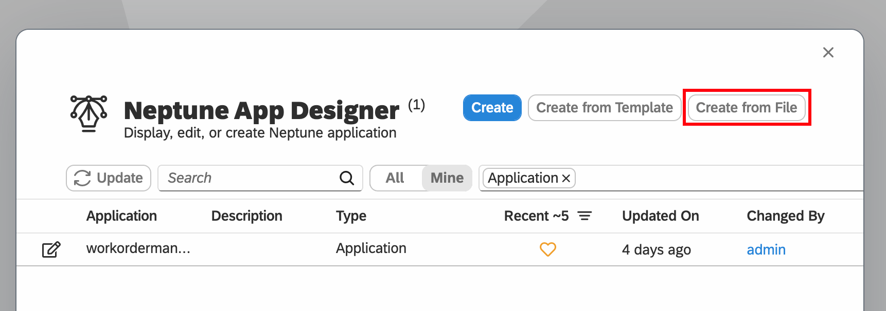
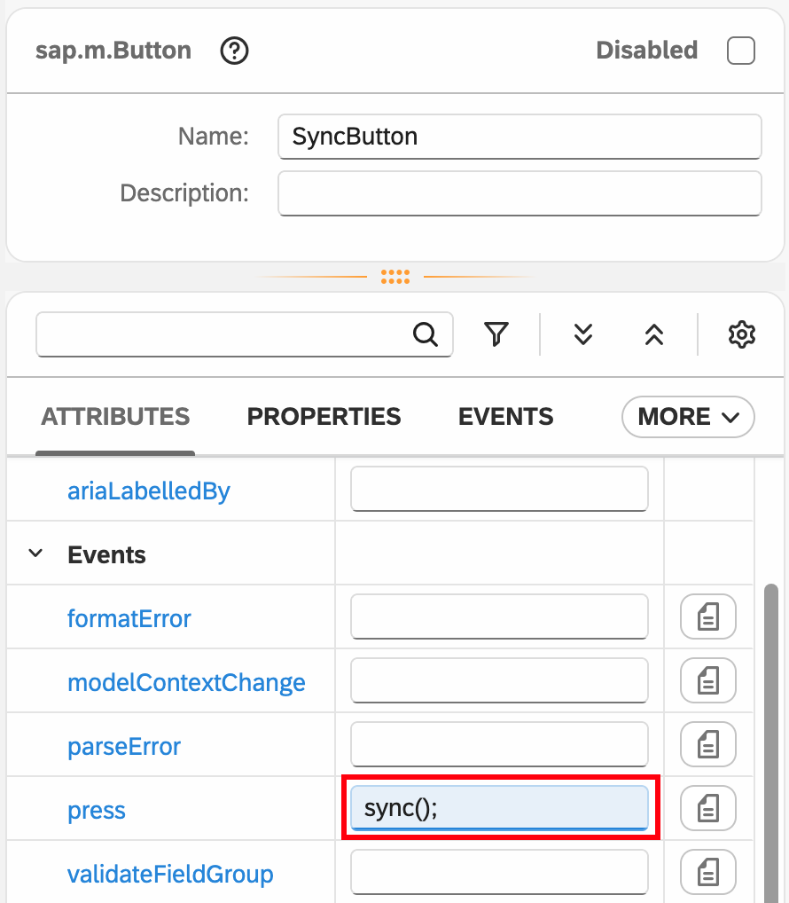
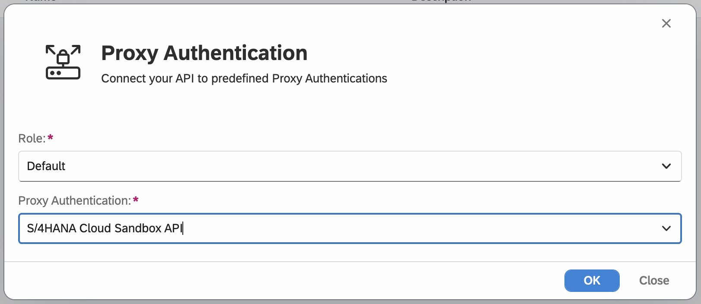

# Offline Work Order applications using SAP OData services

This repository contains the instructions to develop Clean-Core Side-by-side extensions with Neptune DXP. 

The following topics are covered in this README.

1. [Installation of Neptune DXP - Open Edition SAP BTP](#1-install-neptune-dxp---open-edition-on-sap-btp-trial-optional)
2. [Neptune Application using S/4 HANA Public Cloud OData Service (Online)](#2-neptune-application-using-s4-hana-public-cloud-odata-service)
3. [Neptune Work Order application with offline capabilities using standard OData services](#3-neptune-work-order-applications-with-offline-capabilities)
4. [Integration of SAP BTP Translation Hub Service](#4-integration-of-sap-btp-translation-hub-service)
5. [Final result - Neptune Work Order application](#5-my-work-order-application)

## 1. Install Neptune DXP - Open Edition on SAP BTP Trial (optional)

Install Neptune Open Edition on SAP BTP. 

The full documenation for installing Neptune DXP - Open Edition on SAP BTP Cloud Foundry can be found here: https://docs.neptune-software.com/neptune-dxp-open-edition/24/installation-guide/install-neptune-dxp-open-edition-on-btp-with-postgreSQL.html

Login to Cloud Foundry
```bash
cf login -a API Endpoint
```

Push Neptune planet9 Docker Container
```bash
cf push neptune-dxp -m 4096M -k 4096M --no-start --random-route --docker-image docker.io/neptunesoftware/planet9:v24.11.0
```

Set Environment variables
```bash
cf set-env neptune-dxp PLANET9_IP 0.0.0.0
```

Enable ssh to make connection to PostgreSQL possible.
```bash
cf ssh -L 63306:<hostname>:<port> neptune-dxp
```

```bash
cf set-env neptune-dxp DB_TYPE postgresql
cf set-env neptune-dxp DB_URI_POSTGRES <value of uri from dialog>
cf set-env neptune-dxp DB_PSQL_SSL true
cf set-env neptune-dxp NODE_TLS_REJECT_UNAUTHORIZED 0
```

To register for a free trial with 2 developer licenses go to our [website](https://www.neptune-software.com/free-trial)


## 2. Neptune Application using S/4 HANA Public Cloud OData Service

The first application we are developing with the Neptune Open Edition App Designer will use the SAP S/4HANA Cloud Public Edition Maintenance Order OData v2 service from [api.sap.com](https://api.sap.com/package/SAPS4HANACloud/odata)

> [!NOTE]  
> This service from the Business Accelerato Hub is read-only

### Neptune cockpit

Login to the [DSAG 25 environment](https://dsag-25.neptune-software.cloud/cockpit.html) with your user and password.

## Proxy Authentication

The Sandbox API uses an API key. Open the `Proxy Authentication` tool and press the `Create` button to configure a Proxy Authentication we will use for the OData service.


In the next screen go to the `Headers` tab and add a new Header with the `+ Add` button.

Copy the value of the APIKey from the Business Accelerator Hub and add as header.


Press `Save` to store the values.

### OData Source

From the Neptune DXP cockpit open the `OData Source` tool and click the `Create` button



Give the OData Source the name: `MaintenanceOrderOdata` and use the endpoint: `https://sandbox.api.sap.com/s4hanacloud/sap/opu/odata/sap/API_MAINTENANCEORDER;v=0002/`


Press `Create`.

In the next screen enable the checkboxes for `Enable Proxy` and `Use in App Designer` and press `Save` on top of the screen.

.

In the Authentication tab. Press Add and Select the `S4/HANA Cloud Sandbox API` Proxy Authentication.


Press Save to store the ODataSource

### App Designer

We can now create a Neptune Application using the above OData service. Open the `App Designer` from the cockpit.

Press the `Create` button to create a new application.


Enter a name for your application eg. `workorders` and press `Create`


> [!NOTE]  
> It's a good practice to store every artefact in a Package so you can easily transport it and use version control with Git.

We now created an empty application in the `App Designer`


From the Control Library, search and drag the `App` control to the `HTML5 Document`


Continue and add the following controls to the App structure.
- DynamicPage under App
- Table under Dynamic Page
- ODataSource under Resources


Select the `DynamicPage` and set the `title` attribute to `Work Orders`


Select `ODataSource` on the left and select the previously configure OData Source `MaintenanceOrderOData` on the right


Select the `Table` control and press the `Model Source`


In the Binding Dialog select the EntitySet `MaintenanceOrders`


Select the `Table` again and right-click to open the context menu. Select `Wizard > Insert Fields (Display)`


Select the fields you want to be displayed as Columns in the Table and press `Create`


This will create the Columns and the Binding for the Table control.


Activate and Run the application


The Application will show the Table and the configured columns, but no data is shown, because the OData Service is not called yet. 


Add `Javascript` to the `Resources`


Select `Javascript` and insert the following code snippet

```js
sap.ui.getCore().attachInit(function (startParams) {
    // Initialise the OData Model
    createODataSource();

    // Trigger OData read
    getODataTable();
});
```


Activate and Run the application


The Complete list of Maintenance Orders is now loaded and visible.


Let's update the date format first so it's more user friendly.

In the App Designer select the `txtTableMaintenanceOrdBasicStartDateTime` and select `date:BrowserSetting` as `text`.
Do the same for the other Date Field `txtTableMaintenanceOrdBasicEndDateTime`.


Activate and Run the application again, and now the Date's are formatter according to the Browser Settings locale.


### Order Detail Page

Add a new `Page` under the `App` control. Rename it to `DetailPage`

>! Note
> Until now we did rename our intial DynamicPage and all other controls, but it's best practice to give all control a good name, so you can easily find it back while searching the controls or related code.

Also add a `SimpleForm` to the `DetailPage`


Select the `SimpleForm` and change the `Model Source` to `ODataSource>MaintenanceOrderType` by selecting the `MaintenanceOrderType` from the EntityType folder.


Right-click on the `SimpleForm` and select the `Wizard > Insert Fields (Edit)`. Select all Properties and press `Create`


Select the `colItemTable` from the `DynamicPage` and change the attribute `type` to `Active`. Now the `press` event can be used to navigate to the DetailPage.


Select `Events` and add click on the button next to the `press` Event. Select `JavaScript`.


Add the following code snippet behind the `colItemTable-press` event.

```js
const context = oEvent.getSource().getBindingContext();
const data = context.getObject();

modelSimpleForm.setData(data);

App.to(DetailPage);
```


On the `DetailPage` select the `navButtonPress` event and add the following code:

```
App.back();
```


Activate and Run the application to see the result.


We now have our first Neptune Application using a standard OData service. We can navigate between the List and the Detail Page.

## 3. Neptune Work Order applications with offline capabilities

Download the [MyWorkOrdersOffline-start.planet9](https://github.com/neptune-software-marketplace/neptunesoftware-dxp-abb-odata-workorders-offline/blob/master/MyWorkOrdersOffline-start.planet9) from the GitHub repository and store in locally.

From the Neptune Cockpit open the `App Designer` and press `Create from File`.



Select the `MyWorkOrdersOffline-start.planet9` file and give the Application a Name like `myworkorders`.

The newly created application contains all the UI5 elements for the `My Work Orders` application. It has a `WorkOrderListPage` with a Table and a `WorkOrderDetailPage`. You can Activate and Run the application already but no OData Service is connected yet. 


### ODataSource

Drag the `ODataSource` control to the `Resources` and rename it to `ODataMaintenanceOrder`. Select `EAM_OBJPG_MAINTENANCEORDER_SRV` as OData Source.


### MultiModel

In the application a `MultiModel` is already available with the name `WorkOrders`. This Multimodel is setup for offline usage by using the following attributes.
- cacheInitLoadFinished: Event triggered after the Cache is loaded on startup of the application
- setCacheType: We will use IndexedDB for offline storage
- setEnableCache: Enable the caching
- setInitLoad: Loads Model Data from offline storage


### OData read

In the `Javascript` add the following code:

```js
function getSAPWorkOrders() {
    // Initialise ODataMaintenanceOrder
    if (!ODataMaintenanceOrder) {
        createODataMaintenanceOrder({});
    }

    // Filter on Responsible Person 
    // (Hardcoded for now, in final application we will use another OData Service 
    // to retrieve the Person Number for current SAP User)
    const filter = new sap.ui.model.Filter("MaintOrdPersonResponsible", "EQ", "57");
    const filters = [filter];

    // Read Work Orders
    ODataMaintenanceOrder.read("/C_ObjPgMaintOrder", {
        filters: filters,
        urlParameters: "$expand=to_MaintOrderOperation",
        success: function (data) {
            modelWorkOrders.setProperty("/orders", data.results);
            setCacheWorkOrders();
        },
        error: function (error) {
            console.log(error);
        }
    });
}
```

This is a function which retrieves the SAP Work Orders with an ODataModel read call, you can $filters, $expands and $select parameters if needed. In this case we will use the $expand `to_MaintOrderOperation` to not only retrieve Work Order Header data but also the related operations. As filter we use the hardcode value of `57` for now.

### cacheInitLoadFinished

In the `cacheInitLoadFinished` we will add some logic to retrieve the SAP Work Orders when we are in online mode and if there is nothing cached yet. 

```js
function cacheInitLoadFinished() {

    const orders = modelWorkOrders.getProperty("/orders") || [];
    
    // Retrieve SAP data only when online and no Work Orders in cache
    if (navigator.onLine && orders.length === 0) {
        getSAPWorkOrders();
    }
}
```

Activate and Run the App to see the Work Orders.


If we navigate to the Detail page we see the binding is not working yet.

### Detail Page binding

Go to the `press` event of the `colItemTable` and add the following code:

```js
const context = oEvent.getSource().getBindingContext("WorkOrders");
const order = context.getObject();

modelWorkOrderDetailPage.setData(order);

App.to(WorkOrderDetailPage);
```

This code will retrieve the binding from the selected tab row and put the data in the model attached to the `WorkOrderDetailPage`. The binding of the fields was already done beforehand.


Activate and Run the application to see the DetailPage.


### Action Buttons

Behind the `Start`, `Stop` and `Finish` buttons there is already some JavaScript code.

The `Start` button will disable the `Start` button and enable the `Stop` button. You can locate the code behind the `Events` in the Control Tree.


The Actual Start Time and End Time will be stored in the local cache model. We can calculate the `Actual` time with these values and then store them later in SAP on the Maintenance Order. Let's update the code of the `Stop` button to calculate the hours.


```js
const startTime = modelWorkOrderDetailPage.getProperty("/StartTime");
const current = new Date();
const actualHours = Math.ceil((current - startTime)/1000/60/60);

modelWorkOrderDetailPage.setProperty("/StopTime", current);

// Store the actual value on the first item of the Operations
modelWorkOrderDetailPage.setProperty("/to_MaintOrderOperation/results/0/Actual", actualHours);

setCacheWorkOrders();

StopButton.setEnabled(false);
FinishButton.setEnabled(true);
```

> !NOTE In this code we cheat a little bit but storing the Actual value only on the first operation. In the final application we can do this calculation for each operation separately. In this demo we only have Order with a Single Operation so it's fine for this example only.

You can test this logic and see it online by Activation and running the application again.

### Offline test

By using the MultiModel and caching functionalities we can run this application in offline mode. Let's test that with the Chrome Browser.

> !NOTE In this example I am using the Chrome Browser, but Firefox, Edge, Brave, Safari should have similar functionalities to test offline modes.

Run the application and open the Developer Tools (Command + Option + I). Go to the `Network` tab and select `Offline` from the dropdown


Test if you can still use the Application.

> !NOTE Reloading the complete application in the browser will not work, for that we need to run the application inside of the Launchpad or a Mobile Client to use the comple offline capabilities of Neptune. We will check this later in the final solution.

### Sync to SAP when online

Go back to the App Designer and add the following code in the `Javascript`

```js
function sync() {
    const orders = modelWorkOrders.getProperty("/orders");
    const completed = orders.filter((order) => order.MaintenanceProcessingPhase === "3");

    for (const order of completed) {

        order.to_MaintOrderOperation?.results?.forEach(x=>{
            const urlParameters = {
                MaintenanceOrder: x.MaintenanceOrder,
                MaintenanceOrderOperation: x.MaintenanceOrderOperation,
                MaintenanceOrderSubOperation: x.MaintenanceOrderSubOperation,
                Actualworkquantity: x.Actual,
                Actualworkquantityunit: "HR",
                Isfinalconfirmation: false,
                Personnelnumber: 57,
                Postingdate: new Date()
            };
            saveActualWork(urlParameters);
        })
    }
}

function saveActualWork(urlParameters) {
    return new Promise(function (resolve, reject) {

        if (!ODataMaintenanceOrder) {
            createODataMaintenanceOrder({});
        }
        ODataMaintenanceOrder.callFunction("/C_MaintOrderOpForActionCreatetimeconf", {
            method: "POST",
            urlParameters: urlParameters,
            success: function (response) {
                console.log("Success:", response);
                resolve(response);
            },
            error: function (error) {
                console.error("Error:", error);
                resolve(error);
            },
        });
    });
}
```

This code will be triggered when press the `Sync` button. It will find the Orders which are completed and call the OData Function Import `C_MaintOrderOpForActionCreatetimeconf` for each operation to save the Actual Work.

To trigger this sync function add the `sync()` behind the press event of the SyncButton.




> !NOTE For this demo we will first implement this manual trigger. Later we can add logic to detect the online/offline state and trigger the sync automatically.


Test and Run the application again and check that the Function Import is executed when pressing the `Sync` button. To see the changes in SAP open transaction `IW33` Display Maintenance Order and check the Operations tab.

### Refresh Button

To enforce a reforce from SAP we can implement the following logic behind the `RefreshButton` button.

Find the button in the Control Tree and add the following JavaScript code behind the button press event:

RefreshButton code
```js
jQuery.sap.require("sap.m.MessageBox");

sap.m.MessageBox.warning("Refresh the data from SAP?", {
    actions: [sap.m.MessageBox.Action.OK, sap.m.MessageBox.Action.CANCEL],
    emphasizedAction: sap.m.MessageBox.Action.OK,
    onClose: function (action) {
        if (action === "OK") {
            getSAPWorkOrders();
        }
    },
});
```


## 4. Integration of SAP BTP Translation Hub Service

In this section we will add the [SAP BTP Translation Hub Service](https://discovery-center.cloud.sap/serviceCatalog/sap-translation-hub?region=all)

> !NOTE
> We will first use the Sandbox API from the Business Accelerator Hub to test it with our application. For Productive usage you will need to activate the SAP BTP service in your own subaccount. You can easily update the configuration for the Productive usage in the API Designer and Proxy Authentication for this. 

Go to the Business Accelerator Hub and open the [Document Translation API](https://api.sap.com/api/documenttranslation/resource/Synchronous_Document_Translation) 

- Click on `Show API Key` and copy the value for later use.

> !NOTE 
> This API Key will be the same as used before when connecting to the S/4 HANA Public Cloud API. We can re use it.

Go to the Neptune Cockpit and open the `API Designer` tool. Press the `Create` button to create a new API.

Fill in a name eg. `TranslationHubAPI` and enter the endpoint and press `Create`

```
https://sandbox.api.sap.com/sapdocumenttranslation
```


In the `General` tab select `Enable Proxy`.

Add a new Operation in the Operations tab

path: `/translation`
method: `POST`


In the `Authentication` tab on top add the `S/4HANA Cloud Sandbox API`

> !NOTE
> We can re-use the APIkey we used previously for the S/4HANA Public Cloud API.




Open the `myworkorders` application again in the App Designer.

- Add a new RestAPI to the `Resources`
- Rename it to `TranslationHubAPI`
- Select the `TranslationHubAPI` as REST API and POST operation.


Add a new `Button` to the CommentsPanel

- Rename it to `TranslateButton`
- Add the text `Translate`
- Select the type `Emphasized`


Add the following function to `Javascript`

```js
function translate() {
    const payload = {
        sourceLanguage: "en-US",
        targetLanguage: "de-DE",
        contentType: "text/plain",
        encoding: "plain",
        strictMode: "false",
        data: CommentsTextArea.getValue(),
    };
    var options = {
        data: payload,
    };

    apiTranslationHubAPI(options).then(function (response) {
        TranslatedTextArea.setValue(response.data);
    });
}
```

Behind the `press` event call this new function `translate();`

Activate and Run the application and you can now test the translation function, by entering some text and press the `Translate` button.
Currently as seen in the code snippet, we translate from English (en-US) to German (de-DE). Feel free to change this to your prefered languages.


## 5. My Work Order application

The finished application as completed until Step 4 including the BTP Translation Hub can be downloaded from the GitHub repository right [here](https://github.com/neptune-software-marketplace/neptunesoftware-dxp-abb-odata-workorders-offline/blob/master/MyWorkOrdersOffline-finished.planet9)

The final result is the application you can import directly from the Marketplace or via Github. This application consist of the `My Work Orders` application we showcased above with the following functionalities:
- Offline capabilities
- OData Service usage for Update Maintenance Orders and storing Attachments
- Camera/Photo upload
- Signature Build block
- PDF Designer to create and design PDF with Work Order data + attachments

